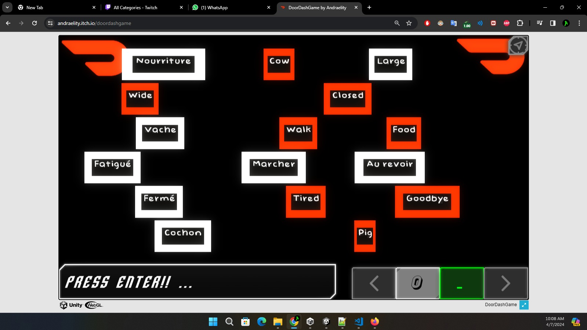
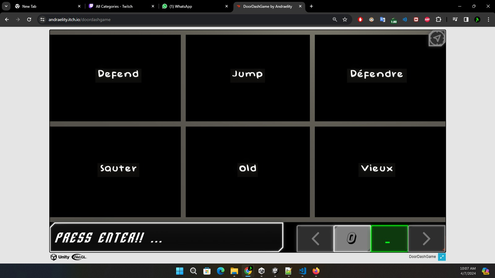
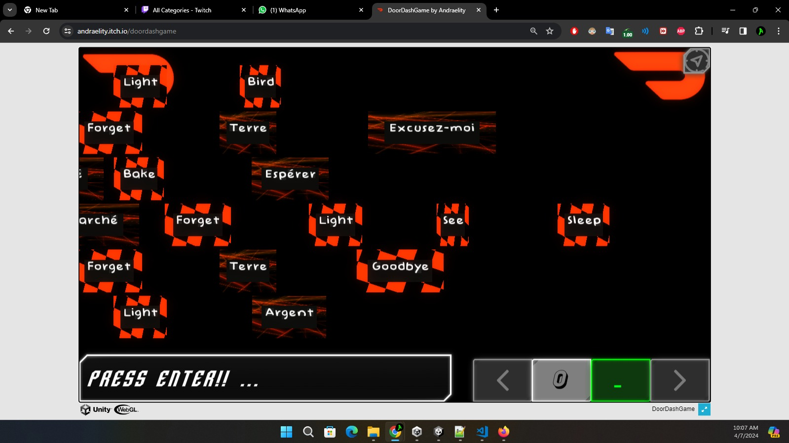
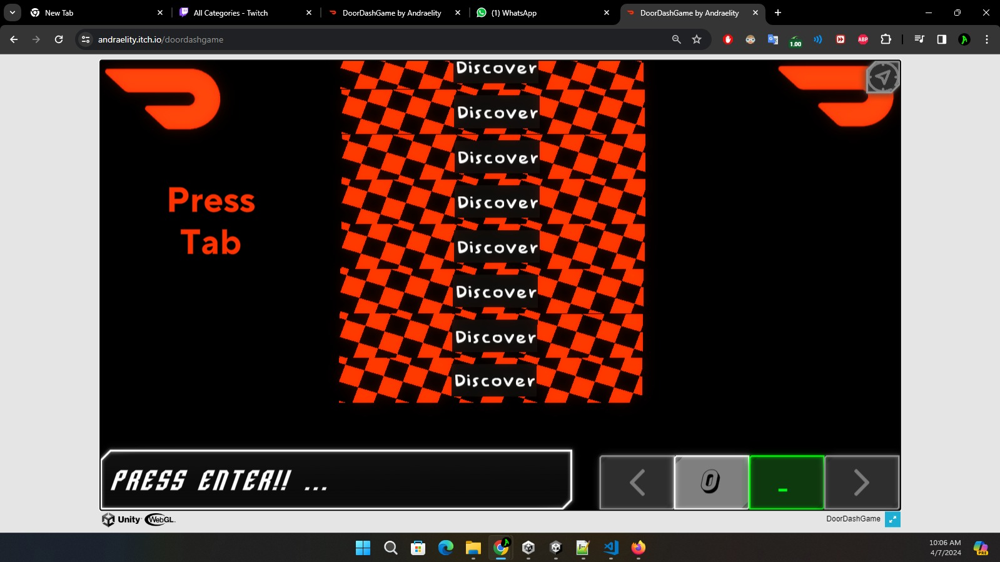
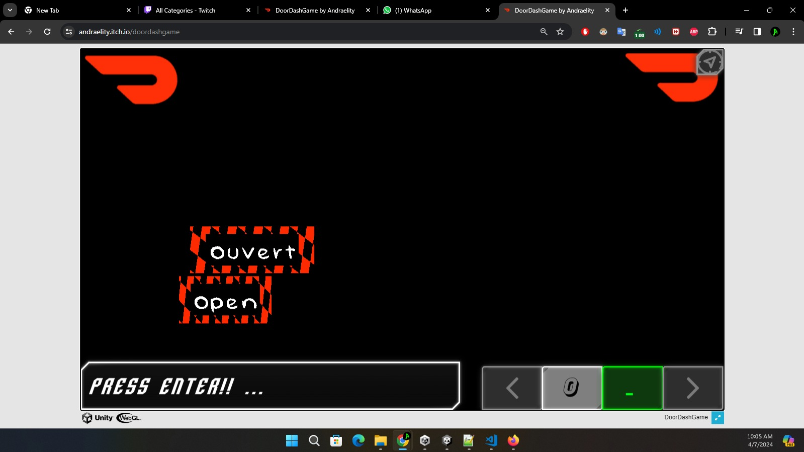
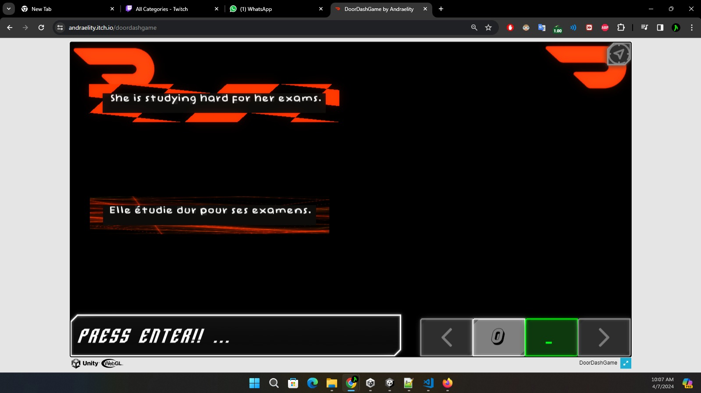
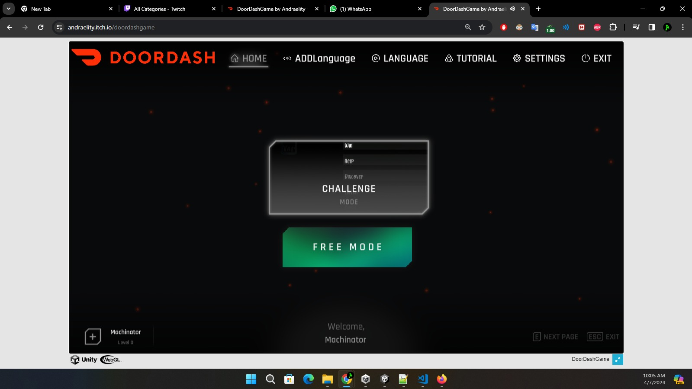
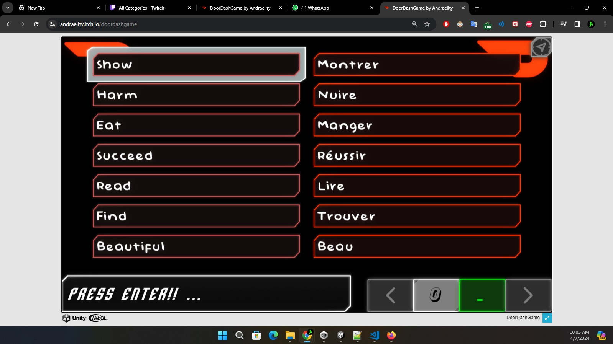
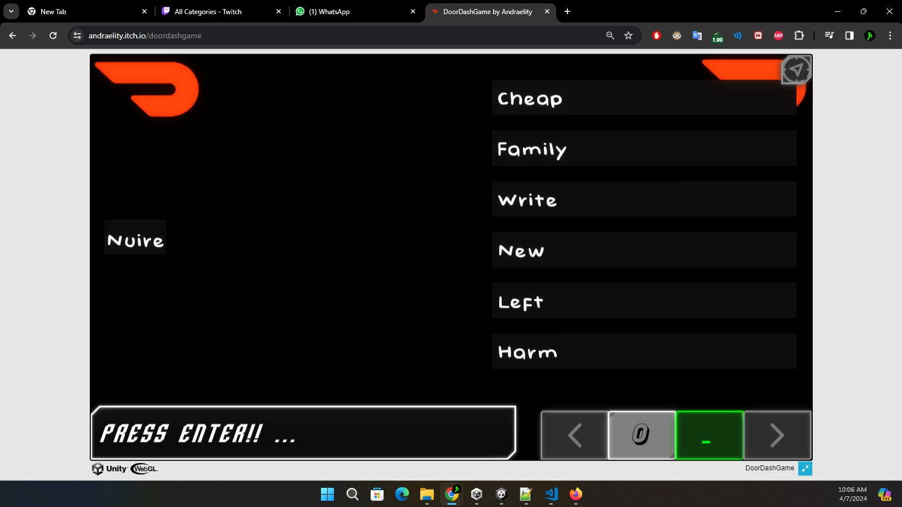
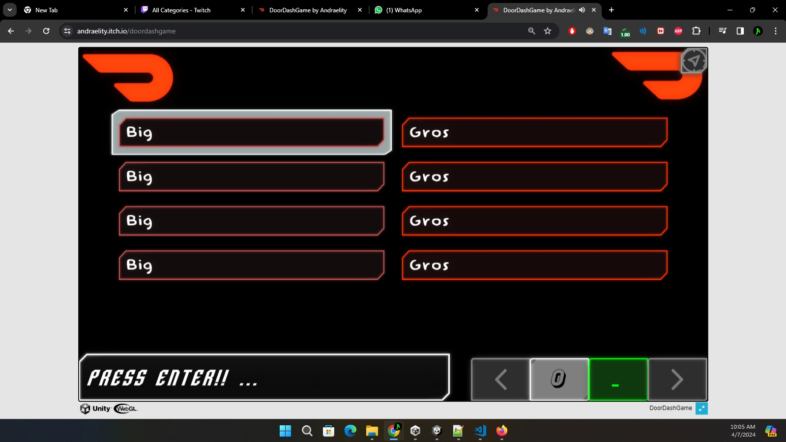

# Unity Shaders Compilation Study Case
Repo on Unity Shaders Study Case

<https://youtu.be/RQRrxaGoJJc>
[Video demo of the project](https://youtu.be/RQRrxaGoJJc)
# CHECK

This are the elements of code that would allow us to improve our workflow, this are the elements, that would allow us to 
create more code examples, code examples, that could be used to create more games around the experience of typing, the experience that could create more field of work, necessary to personalize this field of work, the code examples that we try to create here are mainly directed to the creation of typing games.
 

 
 